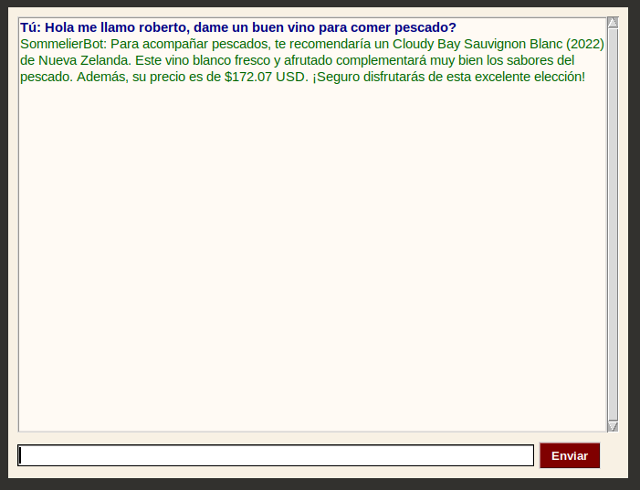

# Wine Chatbot

El siguiente repositorio fue creado para crear un chatbot que funcione como un sommelier experto
en vinos para una empresa, tiene contexto del stock y puede dar recomendaciones según lo que necesite
para más informacion ir a [Reporte del proyecto](./document/main.pdf)

## Como correr el programa

Para correr el programa necesita primero instalar paquetes
```
pip3 install -r requirements.txt
```
Despúes de tener todos los paquetes instalados puede correr el programa con
main.py
```
python3 main.py
```
Este programa usa la API de Copilot, por lo que se necesta un API key para correr.
Para este caso agregue dentro del repositorio mi API key, esta cifrado y antes del correr el programa
le pedirá una contraseña, si la necesita para probarlo puede escribirme a
raalvarado6@utpl.edu.ec. Este proyecto es para la universidad entonces le pasaré la
contraseña a mi profesor para que pueda ver como funciona.

Si buscas correr con tu propia API Key de OpenAI, puedes hacerlo
creando un archivo .env dentro del mismo directorio del main.py, con esto
no te pedirá una clave e utilizaré tu API key
tiene que tener el archivo este formato

```
OPENAI_API_KEY="<api_open_ai-key>"
```

## Algunas imágenes




